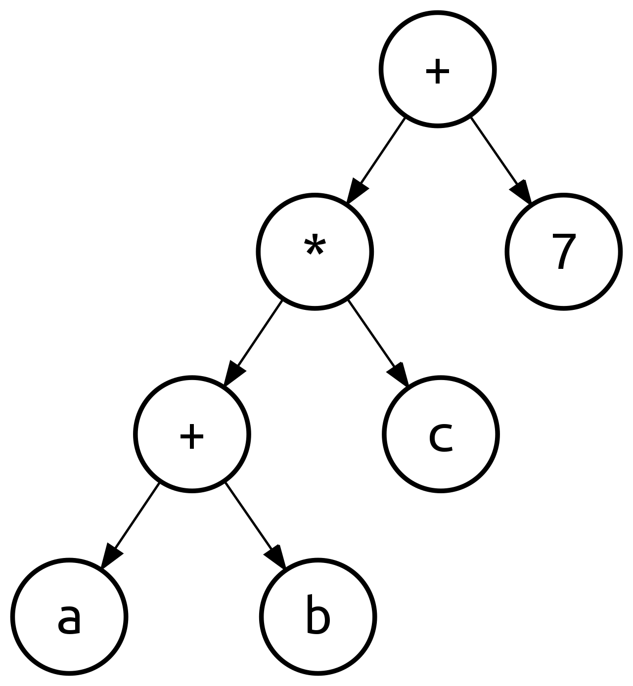
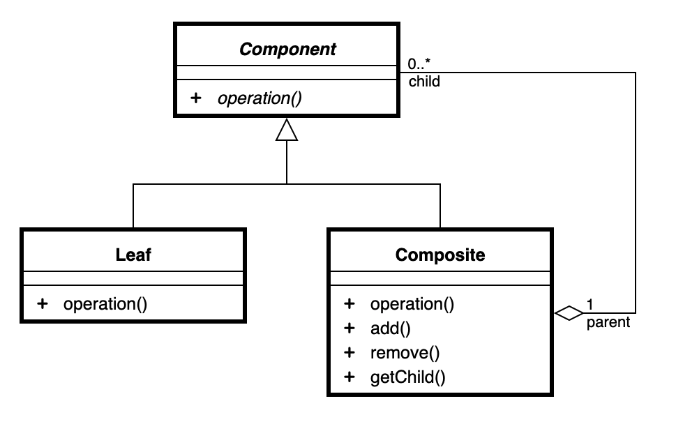
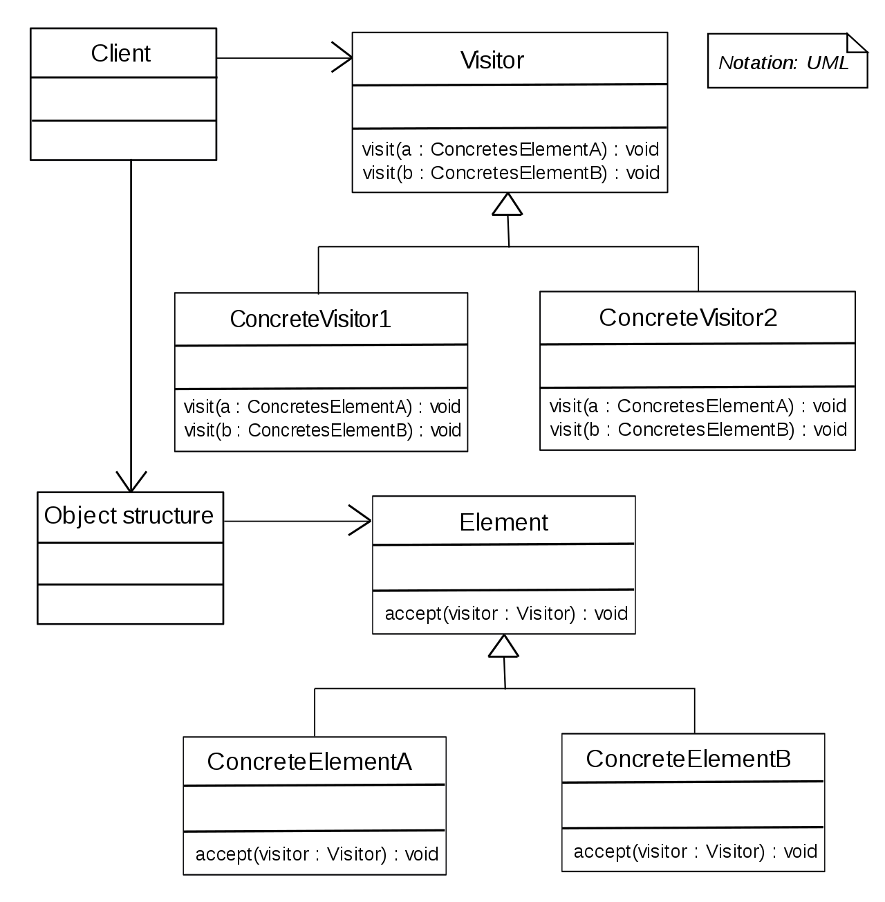

# Binary Expression Tree
A binary expression tree is a specific kind of a binary tree used to represent expressions. Two common types of expressions that a binary expression tree can represent are algebraic and boolean. These trees can represent expressions that contain both unary and binary operators.[1]

\
Fig. 1 - Binary expression tree of expression (a+b)*c+7.

The present Java implementation uses differnt classes for numbers and operators, e.g. addition, product. It implements **Composite pattern**. Also, as a way to represent operations **Print** and **Evaluate Expression** to be performed on the elements of the object structure  it uses **Visitor** design pattern [5].

## Composite pattern
In software engineering, the composite pattern is a partitioning design pattern. The composite pattern describes a group of objects that are treated the same way as a single instance of the same type of object. The intent of a composite is to "compose" objects into tree structures to represent part-whole hierarchies. Implementing the composite pattern lets clients treat individual objects and compositions uniformly [1].

Fig. 2 - UML class design of Composite pattern.

## Visitor pattern
Visitor is a behavioral design pattern that lets you separate algorithms from the objects on which they operate [3].

In essence, the visitor allows adding new virtual functions to a family of classes, without modifying the classes. Instead, a visitor class is created that implements all of the appropriate specializations of the virtual function. The visitor takes the instance reference as input, and implements the goal through double dispatch [4].

\
Fig. 2 - UML class design of Visitor pattern.

## Cite this work
    J. Rico, (2019) Binary Expression Tree using Composite and Visitor design patterns. 
    [Source code](https://github.com/jvirico/binary_expression_tree)

## References
[1] - [Binary expression tree Wikipedia](https://en.wikipedia.org/wiki/Binary_expression_tree)\
[2] - [Composite Pattern Wikipedia](https://en.wikipedia.org/wiki/Composite_pattern)\
[3] - SHVETS, Alexander. Dive Into Design Patterns. Refactoring. Guru, 2018.
\
[4] - [Visitor Pattern Wikipedia](https://en.wikipedia.org/wiki/Visitor_pattern#:~:text=In%20object%2Doriented%20programming%20and,structures%20without%20modifying%20the%20structures.)\
[5] - [PPCU, Budapest. Design Patterns](http://ipcv.eu/blog/course/programming-methodology/)